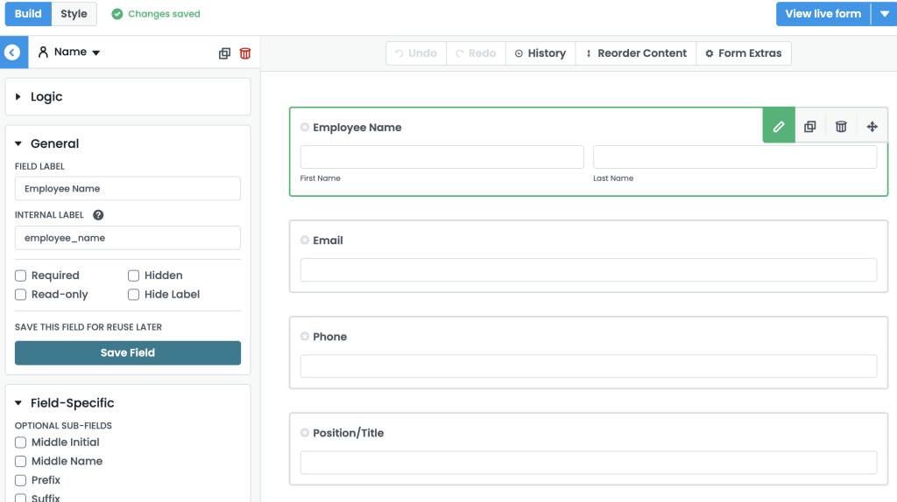

With the launch of V4 of Formstack Forms earlier this year, a new feature was introduced called the Live Form API. This API is a new way for developers to interact with their Forms utilizing JavaScript to implement custom logic, get and set values, and much more.

For full disclosure and transparency, at the time of this writing I am employed by Formstack as a software engineer.

## What Is Formstack?

Formstack is a no-code platform for collecting, managing, and usefully using data. The core offering is the Forms application, which is a drag-and-drop Form builder, and they also have applications for generating dynamic Documents and managing eSignatures.

### Why the Live Form API?

In order to understand why the latest version of Forms uses an API to interact with the Form, it is necessary to understand how Forms are implemented.

Formstack Forms are rendered using React.js, which means that values are not set directly the DOM, as would be the case with a basic HTML Form. Rather, React’s Virtual DOM manages the Form’s state. This means that if we use plain vanilla JavaScript to manipulate the DOM directly, those changes will not be reflected in React’s internal state, which ultimately controls the data sent in the form submission.

To solve this problem, the Live Form API exposes methods that allow us to dynamically handle values, register event listeners, and more.


## Using the Live Form API

There are a number of methods available in the Live Form API. The entire documentation can be found here. For this post, I will focus on some of the most common use cases developers will use on a typical Form project.

## Accessing the Form Object

In order to use the Live Form API, we need to hook into the API using the fsApi‘s getForm() method. This is done by passing our Form ID, which is easily retrieved from the URL in the Form builder (the URL structure is /admin/form/builder/FORM_ID):

```javascript
const form = window.fsApi().getForm("FORM_ID");
```

Once we have initialized the form object, there are a number of methods we can use to interact with fields.

## Accessing a Specific Field

The Live Form API exposes a number of methods that can be used to select specific fields, but for this article we will focus on the getField method.

getField expects a field ID. Field ID’s can be discovered by inspecting the field in the browser’s developer tools, but they are also available in the builder URL when the field is selected.



Once we have grabbed the field ID, we can pass it to getField and set the result into a variable:

`const field = form.getField("FIELD_ID");`
